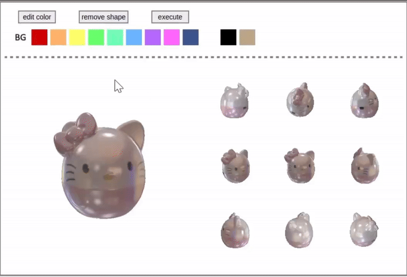

<p align="center">
  <h2>
    ✨ CEI-3D: Collaborative Explicit-Implicit 3D Reconstruction<br>
             for Realistic and Fine-Grained Object Editing
  </h2>
</p>
Welcome to the official code repository for 🚀 🚀 CEI-3D! 🚀 🚀
This project enables highly <strong>realistic</strong> and <strong>fine-grained</strong> 3D object editing from multi-view images, powered by a collaborative explicit-implicit design.

---

## 🎥 Interactive Demo

We provide a demo of our interactive editing interface below:  
(*We're adding support for electronic pen input to allow more precise control than a traditional mouse.*)

<p align="center">
  
  <br>
  <em>Figure: Real-time editing interface using CEI-3D. 🎨🖌️</em>
</p>

---

## 🧠 Key Features

- 🔄 **Collaborative explicit-implicit representation**
- 🎨 **Fine-grained control over geometry and appearance**
- 🧩 **Realistic and seamlessly integrated editing**
- ✏️ **Support Part-aware editing**


### Data Preparation
DTU: we provide proccessed data on google drive. 
Link: https://drive.google.com/drive/folders/19hmE0WvYfw-eKXObTCK065rojphr_0iQ?usp=drive_link
NeRF-Synthetic: use code in code/dataset/...

### How to Run

Terminal Commands

```bash
cd codes

## train uneditied models
python training/two_stage_training/exp_runner_unedited_models.py --conf confs_sg/default_two_stage_training.conf --data_split_dir ../example_data/kitty/train --expname kitty --nepoch 2000 --max_niter 200001 --gamma 1.0

## eval
python evaluation/eval.py --conf confs_sg/default.conf --data_split_dir ../example_data/kitty/train --expname physg_synthetic/kitty --gamma 2.2  --exps_folder exps/0_unedited_models

## color editing & texture editing
python diffuse_finetune/envmap_finetune.py --conf confs_sg/dual_mlp_cdist.conf --data_split_dir ../example_data/kitty/edit1/data --expname physg_synthetic/kitty --exps_folder exps --gamma 1.0 --resolution 256 --edited_image ../example_data/kitty/edit1/edited_diffuse.png --n_epochs 2000 --mask_image ../example_data/kitty/edit1/scribble_mask.png --task 2_texture_editing --flag 0_unrelight_finetune --lr 1e-3

python diffuse_finetune/eval_dual_mlp_cdist.py --conf confs_sg/dual_mlp_cdist.conf --data_split_dir ../example_data/kitty/train --expname physg_synthetic/kitty --exps_folder exps --gamma 2.2 --resolution 256 --model_params_dir ../iccv23/exps/2_texture_editing/kitty/0_unrelight_finetune --threshold 1e-1 --task 2_texture_editing --flag 2_unrelight_thres_1e-1

### geometry editing
# sampling sdf data
python geometry_editing/sdf_sampling.py 

# finetuning sdf
python geometry_editing/sdf_finetune.py

# finetuning diffuse albedo
python geometry_editing/diffuse_albedo_finetune.py

# eval geometry editing
python geometry_editing/eval_geometry_editing.py

cd codes

### geometry editing

# ARAP deformation
## use blender to generate the deformed mesh

# sampling sdf data
# L10指定arap之后的mesh路径，L40保存sdf采样点坐标和数值
python geometry_editing/sdf_sampling.py 

# finetuning sdf
# L154指定形变后的sdf路径
python geometry_editing/sdf_finetune.py

# finetuning diffuse albedo
# L138指定形变后的mesh，更新diffuse albedo
# L234保存模型
python geometry_editing/diffuse_albedo_finetune.py

# eval geometry editing
# L90 load上一步L234保存的模型
python geometry_editing/eval_geometry_editing.py

python training/two_stage_training/exp_runner_unedited_models.py --conf confs_sg/default_two_stage_training.conf --data_split_dir ../example_data/bear/train --expname bear --nepoch 2000 --max_niter 200001 --gamma 1.0
```


